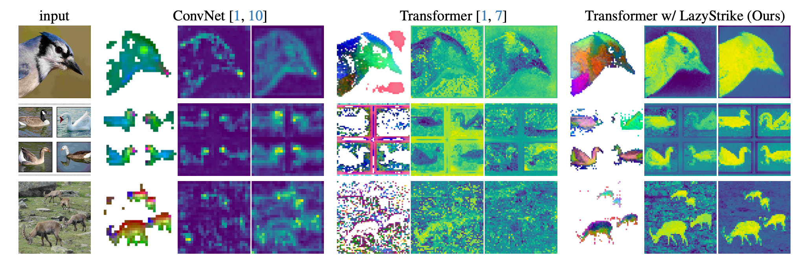

<h1 align="center">LAST-ViT</h1>
<h3 align="center">Vision Transformers Need More Than Registers</h3>

<p align="center">
  <a href="https://arxiv.org/abs/2602.22394"></a>
  <a href="https://github.com/ChengShiest/LAST-ViT/releases"></a>
</p>

<p align="center">
  <strong>Cheng Shi</strong> · <strong>Yizhou Yu</strong> · <strong>Sibei Yang</strong>
</p>

<p align="center">The University of Hong Kong & Sun Yat-sen University</p>

<p align="center">
  
</p>

---

## Abstract

Vision Transformers (ViTs), when pre-trained on large-scale data, provide general-purpose representations for diverse downstream tasks. However, artifacts in ViTs are widely observed across different supervision paradigms and downstream tasks.
Through systematic analysis of artifacts in ViTs, we find that their fundamental mechanisms have yet to be sufficiently elucidated.
In this paper, through systematic analysis, we conclude that these artifacts originate from a lazy aggregation behavior: ViT uses semantically irrelevant background patches as shortcuts to represent global semantics, driven by global attention and coarse-grained semantic supervision. Our solution selectively integrates patch features into the CLS token, reducing the influence of background-dominated shortcuts and consistently improving performance across 12 benchmarks under label-, text-, and self-supervision.
We hope this work offers a new perspective on ViT behavior.

## Method

LAST-ViT replaces the standard CLS token with a frequency-domain token selection mechanism:

**Before (standard ViT):**
```python
x = self._process_input(x)
x = torch.cat([batch_class_token, x], dim=1)
x = self.encoder(x)
cls_token = x[:, 0:1]
return cls_token
```

**With LAST-ViT:**
```python
x = self.encoder(x)

x_detach = x[:, 1:]
x = torch.fft.fft(x[:, 1:], dim=-1)
gs_k = self.gaussian_kernel_1d(kernel_size, sigma)
x = torch.fft.fftshift(x, dim=-1)
x = x * gs_k
x = torch.fft.ifftshift(x, dim=-1)
x = torch.fft.ifft(x, dim=-1).real
diff = x_detach / torch.abs(x - x_detach)
_, indices = torch.topk(diff, k=1, dim=1, largest=True)
sel_p = torch.gather(x_detach, 1, indices)
cls_token = torch.mean(sel_p, dim=1)
return cls_token
```

## Pre-trained Weights

| Training Scenario | Training Script | LAST-ViT Weight |
| :---: | :---: | :---: |
| Self-supervised (DINO) | [facebookresearch/dino](https://github.com/facebookresearch/dino) | [Download](https://github.com/ChengShiest/LAST-ViT/releases/download/weights/dino0080.pth) |
| Text-supervised (CLIP) | [mlfoundations/open_clip](https://github.com/mlfoundations/open_clip) | [Download](https://github.com/ChengShiest/LAST-ViT/releases/download/weights/openai_b_16.pt) |
| Label-supervised (ViT-B/16) | [cls_pretrain/](cls_pretrain/) | [Download](https://github.com/ChengShiest/LAST-ViT/releases/download/weights2/ViT_190k.pth) |

## Getting Started

### Installation

```bash
pip install torch torchvision detectron2 fvcore omegaconf tqdm matplotlib scipy
```

### Classification Training

```bash
python cls_pretrain/lazy_train.py \
    --config-file cls_pretrain/conf.py \
    --num-gpus 8 \
    dataloader.train.dataset.root=/path/to/imagenet
```

### Evaluation: Patch-BBox Hit Ratio

Evaluate whether the highest-scoring patch from LAST-ViT falls inside the ground-truth object bounding box:

```bash
python visualization/evaluate_patch_hit.py \
    --checkpoint ViT_190k.pth \
    --imagenet-root /path/to/imagenet \
    --batch-size 32
```

## News

- **[2026-03]** Initial release: code, pre-trained weights (DINO / CLIP / ViT-B16), and patch-bbox evaluation. Sanity check coming soon.

## Citation

```bibtex
@article{shi2026vision,
  title={Vision Transformers Need More Than Registers},
  author={Shi, Cheng and Yu, Yizhou and Yang, Sibei},
  journal={arXiv preprint arXiv:2602.22394},
  year={2026}
}
```
